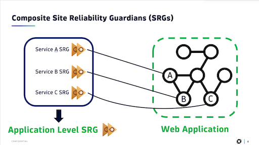
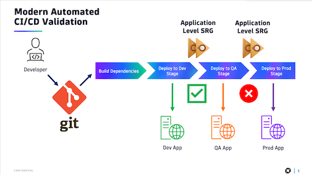

# Dynatrace Composite Site Reliability Guardians (SRGs) | GitHub Actions Example

## Background

Welcome 👋. This repository builds upon a Dynatrace Observability Lab example around Composite SRGs.

You might be asking yourself, what are Composite SRGs?  What's an SRG?  Who's Dynatrace?

For these questions, I'd like to refer you to the following links to dive deeper and learn more about Dynatrace
and the problems we help developers solve in the Observability space.

- [What Is Dynatrace?](https://docs.dynatrace.com/docs/get-started/what-is-dynatrace)
- [Dynatrace Site Reliability Guardian](https://www.dynatrace.com/hub/detail/site-reliability-guardian/)

> In short, Dynatrace is a revolutionary platform that delivers analytics and automation for unified observability and security.

### _What's a Composite SRG?_

Now that we've covered the basics, a Composite SRG is a logical grouping of individual SRGs which monitor an application
or services.  The concept behind creating a Composite SRG is so that teams have a single indicator representing the health
of their application driven by key service indicators (SLIs) that they've established.

With this single indicator unlocks a world of automation and possibilities

### _How do I create a Composite SRG?_

The creation of a Composite SRG depends on writing DQL queries which inspect the business events emitted by other SRGs
your team identifies as being related

### _What is the goal of this repository?_

One of the developer productivity enhancements that a Composite SRG offers is automation of pipeline quality gates.  Now
that we have a single indicator of application health, we can integrate this status into our pipeline stages.

This repository contains Python code which
1. Launches a Workflow executing all related SRGs
1. Checks when the SRGs have completed
1. Inspects the Composite SRGs final status

This Python code is then integrated with GitHub Actions to run the Python Code on any commit.  This ultimately completes
the Composite SRG demonstration by showing how the Composite SRG can be integrated with a developer's pipeline.

## Configuration

### Background

To help demonstrate the concept of Composite SRGs, this repository contains a variety of files to help get you started.
Each folder contains a subsequent README with screenshots and more detail on each file.

1. Workflows
    - In a production setting, only one workflow is required which will orchestrate the execution all dependent SRGs first then execute the composite SRG
        - This workflow looks for SRGs tagged with a specific tag and will then execute those SRGs
        - After those SRGs complete, we will run the Composite SRG
    - In order to demo the Composite SRG, we have an additional workflow which will generate mock metrics and corresponding SLOs.
        - The workflow generates a series of metrics corresponding to four microservices (defaults to `['Billing', 'Checkout', 'Frontend', & 'Scheduler']`)
        - The workflow has a single step where you can define the metric names and whether the service should have "degraded" metrics in order to trigger the SLO
        - This same step can also be used to either create or delete the required SLOs for the SRGs
1. SRGs
    - We've provided a JSON export from Monaco of the two types of SRGs you'll need to define
        - A service level SRG which is comprised of the SLOs for that service
        - A Composite SRG which inspects the result of each service SRG
    - Due to how the Dynatrace APIs currently work, you will need to modify `01-individual-service-srg.json` file for your use case and leverage monaco to create those SRGs.
        - If you're using the mock metric workflow, four SRGs will need to be created, one for each of the mock services.
    - The same approach can be taken for the `02-composite-srg.json` file to define the Composite SRG.
1. GitHub Actions Pipeline & Script
    - Part of the appeal of the Composite SRG is to integrate it with your code deployment process
    - Within `composite_srg_pipeline` we have a Python script that, when a commit is made, executes the SRG workflow and inspects the result.
    - Within `.github/workflows` is defined the GitHub Actions Pipeline itself.

### Step 1: Upload Workflow Templates

- `01-GenerateSLOs-and-metrics.yaml`

This workflow is responsible for generating mock data to prove the concept of Composite SRGs.
It will generate metrics to feed SLOs for four mock microservices.  It also has the ability to trigger "degredation" for these services
to breach the SLOs and demonstrate how the SRGs will respond.

If you have no need to generate mock data, it's not required

- `02-Execute-SRGs.yaml`

The principle behind Composite SRGs is to have dependent SRGs (mapping to individual services) execute first and the
Composite SRG then inspects the result of those dependent SRGs.  Rather than attempting to execute all of these SRGs
individually, we can use this workflow to coordinate the execution of all the moving pieces.

This workflow hinges on all dependent SRGs being tagged with a specific tag.  The workflow will search all SRGs for this
tag and then execute the SRGs.  We will then wait for the completion of all dependent SRGs before executing the Composite SRG.

### Step 2: Upload/Create SRGs

- `01-individual-service-srg.json`

As we mentioned above, we have dependent SRGs which track SLOs at a per service level and we have the Composite SRG which ties them
all together into a single result.

This monaco export demonstrates how a single Service SRG is defined as an example.  If you plan to use monaco to upload this
file, please make sure to modify it according to your usecase (SLO names, target values, warning values, etc.)

- `02-composite-srg.json`

Another monaco export, this file is an example of a Composite SRG which looks at the result of four dependent SRGs.
Again, this file should be modified for your usecase but has been configured to be compatible with the SLOs
generated by the mock workflow.

### Step 3: Integrate your GitHub Actions Pipeline with the Composite SRG

- `/.github/workflows/push_action.yaml`

An example of a GitHub Actions pipeline that will inspect the status of your Composite SRG immediately after a push.
Depending on your development practices, this might be best practice while waiting 15-20 minutes before execution might
be better fit so as to allow any new code to properly reflect in statistics and metrics.

- `/composite_srg_pipeline`

This directory contains a Python script which, when a GitHub commit is made, will run the workflow `02-Execute-SRGs.yaml` and inspect
the result of the Composite SRG.

In order to know what the Composite SRG is and be able to communicate with your Dynatrace Tenant, you will need to define the following
Environment Variables as GitHub secrets.

#### Environment Variables

This Python Project uses Pydantic's `BaseSettings` class in-order to tune the code for the relevant environments.
All configurable parameters can be seen in `./composite_srg_pipeline/config.py`

- `DT_TOKEN_URL`: The OAUTH2 URL used to request a bearer token. Default Dynatrace URL is `https://sso.dynatrace.com/sso/oauth2/token`.
- `DT_CLIENT_ID`: OAUTH2 Client ID.  See [Dynatrace Documentation for further details](https://docs.dynatrace.com/docs/manage/identity-access-management/access-tokens-and-oauth-clients/oauth-clients#create-an-oauth2-client).
- `DT_CLIENT_SECRET`: OAUTH2 Client Secret.  See [Dynatrace Documentation for further details](https://docs.dynatrace.com/docs/manage/identity-access-management/access-tokens-and-oauth-clients/oauth-clients#create-an-oauth2-client). 
- `DT_SRG_WORKFLOW_UUID`: Dynatrace has a workflow used to orchestrate execution of all prerequisite SRGs. This should be set to the UUID of that workflow.
- `DT_TASK_NAME`: In the above Composite SRG Workflow, there is a single step which is responsible for executing the Composite SRG. This field should correpsond to that name.
- `DT_TENANT_ID`: The 8 character Tenant ID taken from `https://<TENANT_ID>.apps.dynatrace.com/ui`
- `WORKFLOW_RETRY_COUNT` _[Optional]_: (3) | The number of attempts we will make to request the status of the Composite SRG Workflow before considering the execution a failure.
- `WORKFLOW_RETRY_DELAY` _[Optional]_: (50) | The time delay (in seconds) between retried API queries for Workflow status.
- `WORKFLOW_RETRY_MAX_DELAY` _[Optional]_: (150) | The longest period of time we will await for a non 'RUNNING' Workflow Status result

##### GitHub Secrets & Variables

The GitHub Actions pipeline sets the above Environment Variables for hte GitHub runner by pulling from GitHub Secrets & Variables.
For the mandatory environment variables above, please ensure to save `DT_CLIENT_SECRET` as a secret and set the remaining variables as
GitHub Variables.