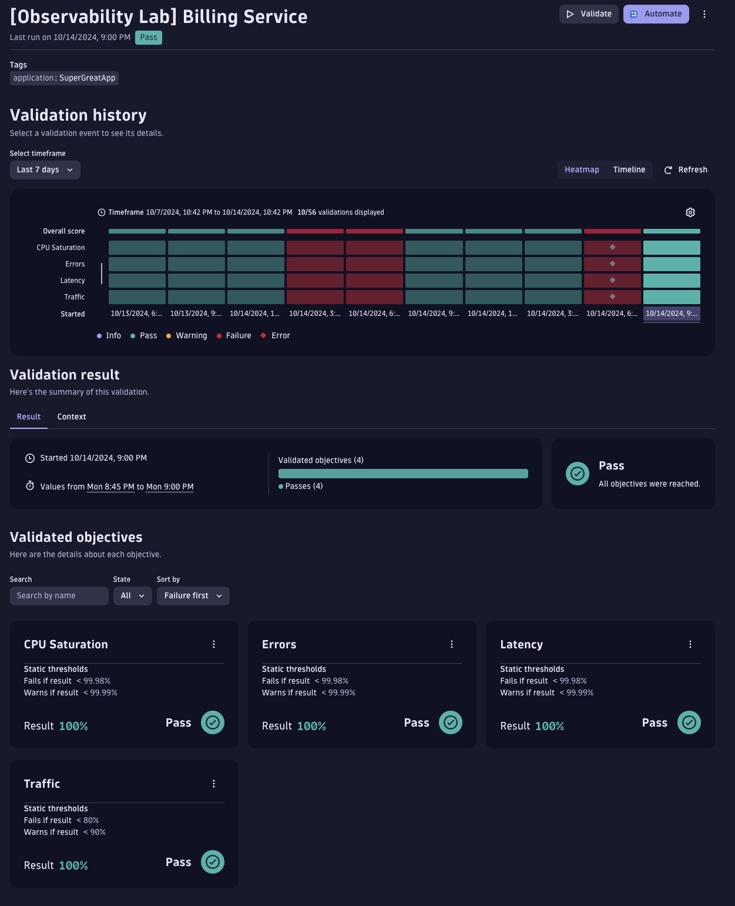
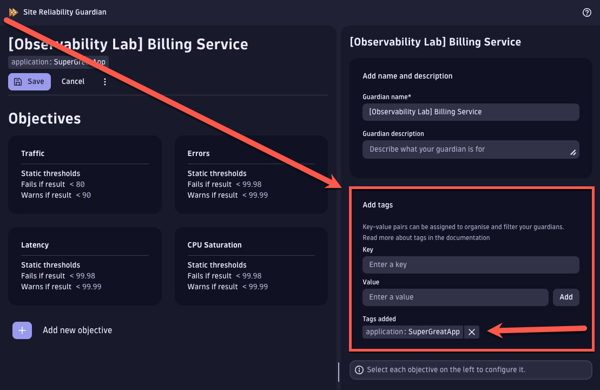
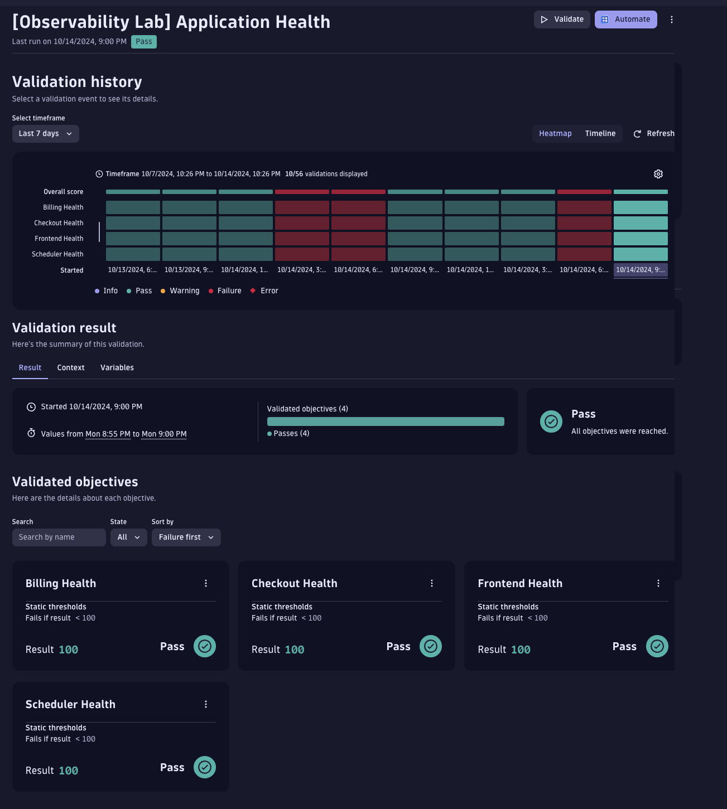

# Site Reliability Guardians (SRGs)

In total, there are two different types of SRGs required for the Composite SRG to function as intended.

1. Service Level SRGs
    - Track SLOs defined at a service level
    - All SRGs need to be tagged with a unique tag so that our workflow can identify them
        - This tag will be defined in the Workflow as well.
1. Composite SRG
    - Executes DQL to inspect the business event for each Service Level SRG execution

The files within this folder are monaco exports from my tenant and match along with the default workflows including the mock workflow generator.
To recreate these SRGs, please use monaco to upload these exports.  I've also included below the DQL query I've used for the Composite SRG as an example.

## `Service Level SRG Example`



Each Service SRG will track individual SLOs defined for that service.

The most important part for everything to work is the tag that is defined.  Each SRG **MUST** have the same tag defined.

Tags can be defined on the top menu when editing the SRG as shown below.



## `Composite SRG Example`



The Composite SRG hinges on the fact that every SRG emits business events after each execution.  Thus, for our Composite SRG,
we can query the last result of each service SRG.

The DQL query that I've used is as follows:

```
fetch bizevents
| filter event.provider == "dynatrace.site.reliability.guardian"
| filter matchesValue(guardian.id, $billing_srg)
| filter matchesPhrase(event.type, "guardian.validation.finished")
| sort timestamp desc
| summarize status = takeFirst(validation.status)
| fieldsAdd result = if(status == "pass", 100, else: 0)
| fieldsKeep result
```

### Identifying Service SRG UUIDs

If you notice I have a variable `$billing_srg` in my DQL query.  This corresponds to the Billing Service SRG's UUID that I've setup in my tenant.

You can find this UUID, along with all of your Service SRG UUIDs with the following DQL query:

```
fetch bizevents, from: now() - 3h, to: now(), scanLimitGBytes: 1
| filter event.provider == "dynatrace.site.reliability.guardian"
| filter event.type == "guardian.validation.finished"
// | filterOut matchesPhrase(guardian.name, "Clinical Application Health")
| summarize count(), by:{guardian.name, guardian.id}
```

The filterOut statement will allow us to filter out unwanted SRGs in our result.
You can then take the resulting `guardian.id` and define it as a variable in your Composite SRG by selecting the  ellipse next to the title.

