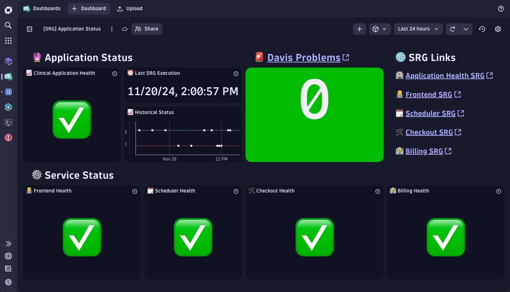
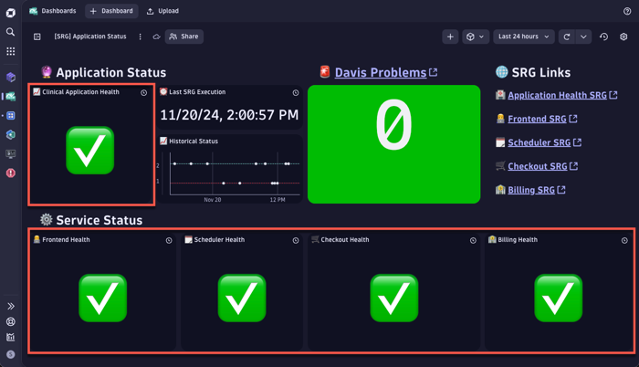
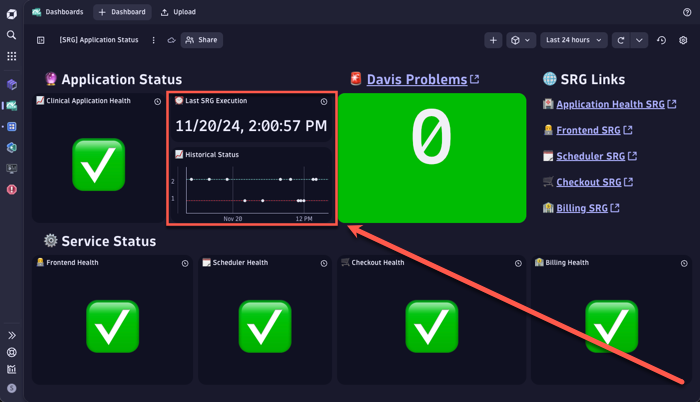

# Application Status Dashboard

One of the use-cases for Composite Site-Reliability-Guardians (SRGs) is to help emit a single indicator of health for your Application.
We can take advantage of the Business Events which SRG executions emit to generate the following high-level dashboard for our application.

If you would like to inspect the dashboard used in the demo, please deploy the
[`SRG_Application_Status_Dashboard.json`](./SRG_Application_Status_Dashboard.json) file within your environment.



## Tiles

### SRG Health Indicator Tiles



The tiles outlined in red query the last result from the SRG execution.  We leverage [the `takeFirst` DQL Function](https://docs.dynatrace.com/docs/discover-dynatrace/references/dynatrace-query-language/functions/aggregation-functions#takeFirst)
combined with `sort timestamp desc` to achieve this.  These tiles are essentially the same DQL query pointing to the
relevant UUIDs for each SRG.

#### [DQL] SRG Status

```
fetch bizevents, from:now() -7d, to:now(), scanLimitGBytes: 1
| filter event.provider == "dynatrace.site.reliability.guardian"
| filter guardian.id == "<SRG UUID>"
| filter matchesPhrase(event.type, "guardian.validation.finished")
| sort timestamp desc
| summarize status = takeFirst(validation.status)
| fieldsAdd result = if(status == "pass", "✅", else: "❌")
```

### Last SRG Execution Tiles



SRGs are designed to evaluate SLOs at a specific point in time.  They can be triggered from an event (like a webhook)
or set to run on a set schedule.  Therefore, it's important to display the timestamp of when the SRGs were last run.

This section has two tiles, one with a clear timestamp of when the SRG was last executed.  The other displays the historical
status of the Composite SRG where 2 equates to a Successful execution and 1 equates to a Failed execution.

#### [DQL] Last SRG Execution

```
fetch bizevents, from:now() -7d, to:now(), scanLimitGBytes: 1
| filter event.provider == "dynatrace.site.reliability.guardian"
| filter guardian.id == "<SRG UUID>"
| filter matchesPhrase(event.type, "guardian.validation.finished")
| sort timestamp desc
| summarize timestamp = takeFirst(timestamp)
```
#### [DQL] Historical SRG Execution

```
fetch bizevents, scanLimitGBytes: 1
| filter event.provider == "dynatrace.site.reliability.guardian"
| filter guardian.id == "<SRG UUID>"
| filter matchesPhrase(event.type, "guardian.validation.finished")
| sort timestamp desc
| fieldsAdd result = if(validation.status == "pass", 2, else: 1)
```
