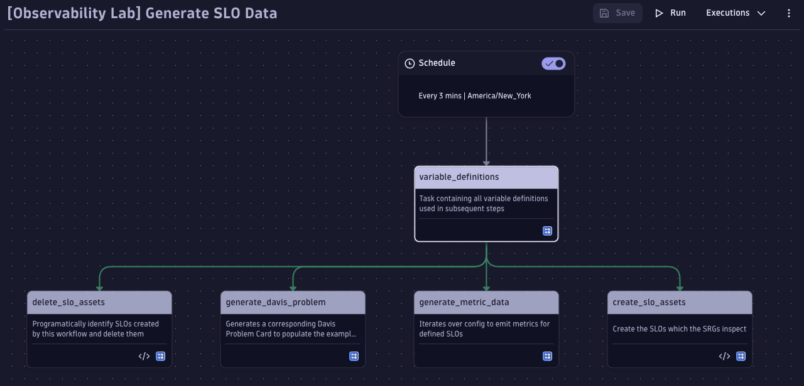

# Composite SRG Workflows

## `01-GenerateSLOs-and-metrics.yaml` - Generates Mock Data for Demo Purposes

If you'd like to prove out the Composite SRG concept in your own Dynatrace environment and don't have a service you can
use, you can use this Workflow instead.  It will generate:

- Metrics for four mock micro services `['Billing', 'Checkout', 'Frontend', & 'Scheduler']`
    - These metrics are borrowed from the golden signals by default
- SLOs for each micro service and each SLI

It will also trigger service failure periodically or on demand.

The workflow centers around the `variable_definitions` step which tunes the workflow.

### Variable Definitions and Meaning

- `workflow_tag`: This will be appended to all naming conventions and is used to help identify which SLOs are generated by this mock workflow.  Used especially to help automatically delete the SLOs.
- `delete_assets`: A boolean flag which, when set to `true`, will automatically delete the SLOs that were created.
- `create_assets`: A boolean flag which, when set to `true`, will automatically create the SLOs that are needed for the SRGs

- `app_config`: This is a list of the four microservices that the corresponding metrics and SLOs will be tied to.  There is a dependency between the name defined and the map key defined in `metric_definitions` so if you change the application name here, make sure to update the key in `metric_definitions`
    - `degrated`: A boolean flag which, when set to `true`, will emit metrics that will cause the SLOs to be breached.  This is set at a service level and requires each metric to also be enabled for degradation under `metric_definitions`.  This is useful if you want to see what a failure scenario looks like for the Composite SRG.
    - `problem_card`: A boolean flag which, when set to `true`, will generate problem cards associated with the micro service.
- `total_degredation`: A single flag which can be used to set all SLOs to be in a failure state.
- `metric_namespace`: A string which is used to define the root of the metric name.  By default it is set to `poc` and thus our metric will look lie `poc.latency` or `poc.saturation.cpu`.
    - `<KEY>`: This key corresponds to the micro service name defined in `app_config`.  They must all match for the workflow to complete successfully.
      - `name`: This is the name of the metric.  So in the case of key name `cpu_saturation` our emitted metric will be `poc.saturation.cpu` due to our name set as `saturation.cpu`
      - `degrated` This is a boolean flag when, used in conjunction with `degrated` under `app_config`, will emit metrics that will breach the defined SLOs.
      - `target`: The SLO target percent.
      - `warning`: The SLO warning percent.

## `02-Execute-SRGs.yaml`

This is the workflow used to orchestrate execution of all the SRGs required.

The Composite SRG requires two types of SRGs to be defined:
1. Service SRGs
    - Tracks the SLOs configured for each service
2. Composite SRGs
    - Tracks the results of each Service SRG

The following steps are defined in this workflow:

### `find_guardians_with_tags`

To help facilitate the execution of all the SRGs, the workflow will identify the service SRGs by a specific SRG tag.

Thus it's important that each service SRG is tagged with a unique phrase across all required SRGs.
In our example we used `application:SuperGreatApp` defined on line 9 of the Javascript.

### `start_service_guardians`

Based on the results found in `find_guardians_with_tags`, Workflows will launch each SRG

### `validate_all_guardians`

Once the previous step completes, this means all dependent SRGs have been run and now the Composite SRG can launch
the necessary DQL to inspect the result of each subsequent SRG.

In order to allow the results to populate to Grail, we've defined an option on this step to have a delay of 30 seconds.
This ensures there's plenty of time since the execution to query the correct iteration.

